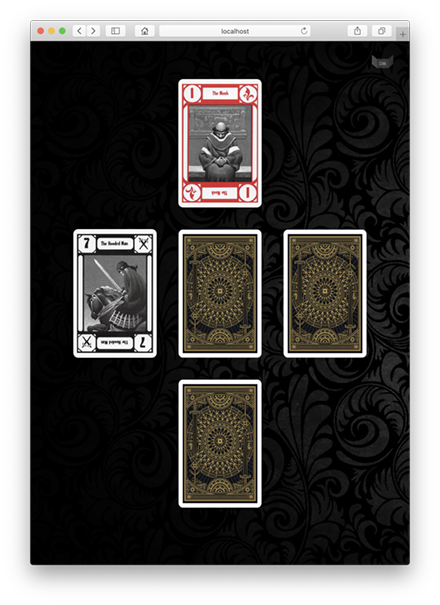
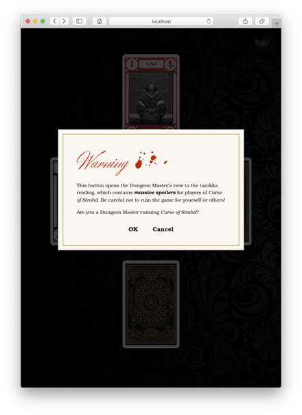
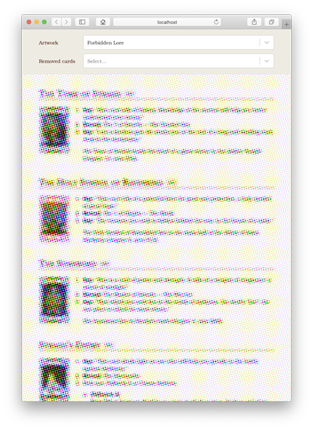

# Tarokka

A randomized tarokka reading for your online Dungeons & Dragons game, implemented in TypeScript and React. Includes a 3D card effect and a Dungeon Master's guide in a separate tab, so you can present the card tab to players while reading the auto-generated notes.

The guide can be opened with the button at the top right. Refresh the main window for a new reading.

Tarokka is the tarot equivalent in Barovia, the ominous kingdom ruled by the immortal vampire Strahd from his home in Castle Ravenloft. See the Dungeons & Dragons fifth edition adventure *Curse of Strahd* for more information.

***Warning:*** *It goes without saying, but the data file and Dungeon Master's guide contain ***massive spoilers*** for players. A warning modal is displayed before opening the guide.*

  

## Available scripts

In the project directory, you can run:

| Command      | Description                                             |
|--------------|---------------------------------------------------------|
| `yarn start` | Runs the app in the development mode.                   |
| `yarn test`  | Launches the test runner in the interactive watch mode. |
| `yarn build` | Builds the app for production to the `build` folder.    |

## Credits

Thanks to [@pvrs12](https://github.com/pvrs12/tarokka) for the initial version of the data file.
